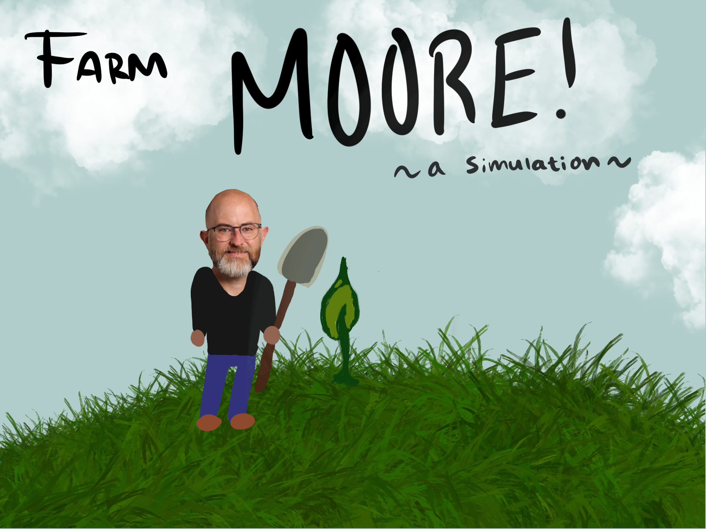
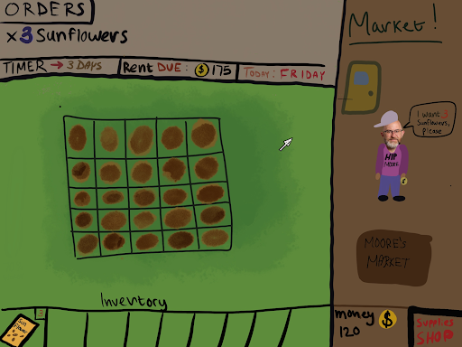
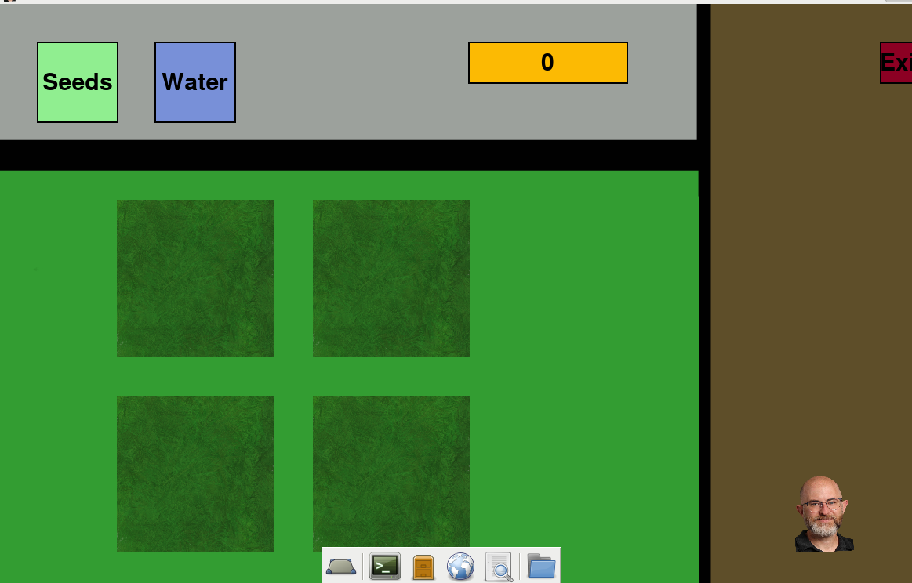
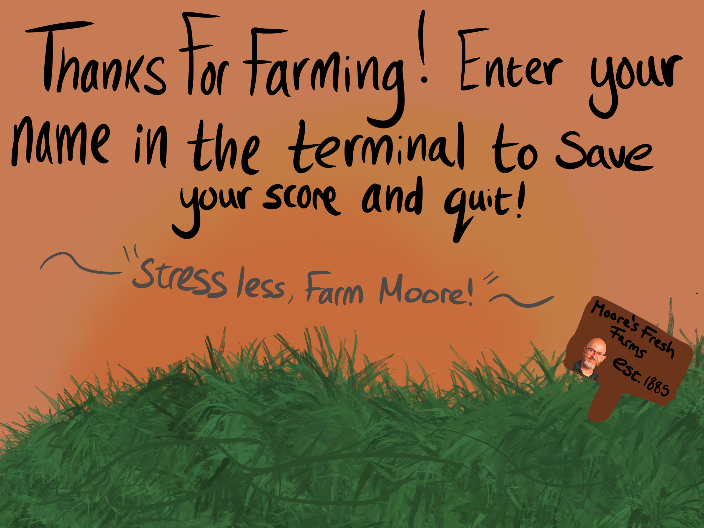
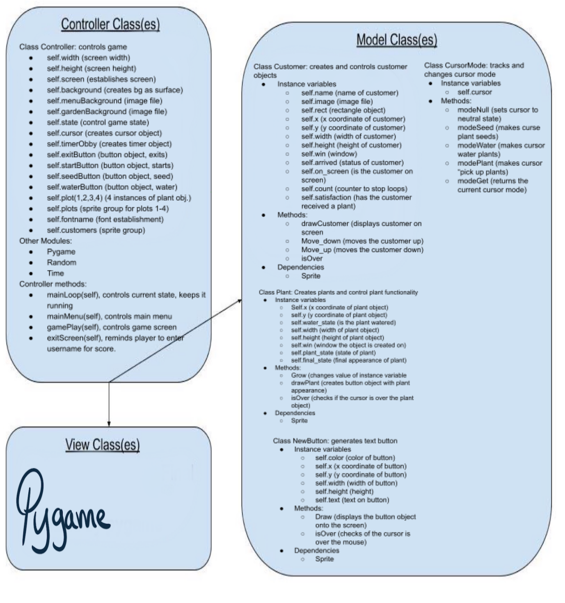

# CS110 Project Proposal
# Farm Moore
## CS 110 Final Project
### Fall, 2021
### [Assignment Description](https://docs.google.com/document/d/1H4R6yLL7som1lglyXWZ04RvTp_RvRFCCBn6sqv-82ps/edit#)

[https://github.com/bucs110a0fall21/final-project-we-are-farmers](#)

[https://docs.google.com/presentation/d/1oRCpV7uFbBlynLYIcH_x5fW4oV3B-aDxPHDNLztd3As/edit#slide=id.g105bf7dcf1b_0_137](#)

### Team: We Are Farmers
#### Adam Acevedo, Luca DiGrigoli, Nicholas Reyes

***

## Project Description *(Software Lead)*
Our project idea is to create a game in which the player will manage a farm, while managing a business that will sell what they grow. There will be a set number of plots in which the player can place plants. The plant will then grow over time. Meanwhile, the player will receive customers that will receive plants in exchange for their currency. The player will then receive the customer's currency by clicking on a fully grown plant and then clicking on the customer. The goal of the player is to gain as much currency as possible.

***    

## User Interface Design *(Front End Specialist)*
* Luca DiGrigoli

* 

* Main Menu (Concept):
    * CONTAINS:
        * Play button: 
            * Begins the game
        * Exit Button:
            * Exits the game

* 

* Gameplay Screen (Concept):
    * CONTAINS:
        * Plots:
            * 5x5 grid of plants to plant seeds in 
        * RENT:
            * Contained a Cash Quota to reach in a certain number of 'days'
        * Timer:
            * Contained a timer of the current day
    * ORDERS:
        *  Contained customer orders the player had to fufill
    * INVENTORY:
        *  Displayed a hotbar of items that the player could use to affect the game
    * Market:
        *  Where "Moore" Customers entered the shop and asked for plant orders. 

* 

* Current Gameplay Screen:
    * CONTAINS:
        * Plots:
            * 2x2 grid of plants to plant seeds in 
        * Market:
            * Where a "Moore" Customer entered the shop and asked for plant orders. 
        * Quit Button:
            * Exits the game, pulls quit screen

* 

* CONTAINS:
    * Quit Button:
        *  Exits the game.

***        

## Program Design *(Backend Specialist)*
* Non-Standard libraries
    * pygame
       https://www.pygame.org/news
       Allows fo the use of video game related functions

    * For each additional module you should include
        * url for the module documentation
        * a short description of the module
* Class Interface Design
    * << A simple drawing that shows the class relationships in your code (see below for an example). >>
        * 
    * This does not need to be overly detailed, but should show how your code fits into the Model/View/Controller paradigm.
* Classes

    Cursormode - The cursormode class changes the state that the cursor is in. This allows different events to occur based on the state of the mouse when certain places are clicked. Each method controls a different cursor stateS. The different cursor modes that the player can be in are "NONE", "SEED", "WATER", "PLANT1", "PLANT2,", and "PLANTFULL".
 
    Plant - The plant class draws plot and plant objects to the gameplay screen. When the player opens the gameplay screen, this class creates 4 plots for the player to interact with. When the player is in the seed cursor mode and click on a plot, this will place down a plant. The plants created by this class will go through 3 different phases. The first and second phase share the same appearance, but the third phase can have one of 4 appearances.

    Customer - The customer class creates customers that will walk into your plant store. Each customer will ask the player for the plant. When the player clicks on a fully grown plant and clicks the customer, the customer will take the plant and the player's score will increase. Each customer will have an image file, x and y position in the your store, dialouge generator, values for a timer, formula for how much they pay.

    NewButton - The NewButton class creates button objects that only have text in them. Class takes color, x value, y value, width value, height, and the button text as the parameters. NewButton contains two methods. The first method "draw", draws a button on to the screen with the option to add an outline to the button. The second method "isOver", checks if the mouse is hovering over a button object.

## Project Structure *(Software Lead)*

The Project is broken down into the following file structure:
* main.py
* demo.mp4
* src
    * controller.py
    * cursormode.py
    * customer.py
    * newbutton.py
    * plant.py
* assets
    * bwmoore.png
    * class_diagram.jpg
    * emptyPlot.png
    * exitBack.png
    * final_diagram.PNG
    * finishedLilac.png
    * finishedPea.png
    * finishedPump.png
    * finishedSun.png
    * finishedTulip.png
    * GardenBack.jpg
    * glitchmoore.png
    * godmoore.png
    * growing.png
    * Icon.png
    * MenuBack.jpg
    * planted.png
    * READMEMAIN.png
    * READMEOLDMAIN.png
    * READMEOLDPLAY.png
    * READMEQUIT.png
    * spacemoore.jpg
    * stevelesse.jpg
* etc
    * N/A

***

## Tasks and Responsibilities *(Software Lead)*

### Software Lead - Nicholas Reyes

Conducted research on class functionality, wrote the docstrings for each method in each class, simplified code where needed, and made sure the gameplay screen was fully functional, interactive, and ran in real time

### Front End Specialist - Luca DiGrigoli

Conducted significant research on controller functionality, provided self-made images for backgrounds and icons, built the controller class, and cursormode class

### Back End Specialist - Adam Acevedo

Created button, customer, garden, and plant classes, established much of the framework of our project's concept, helped to give our project's ideas direction

## Testing *(Software Lead)*
* Whenever we attempted to implement a new feature we tested it through the GUI by making sure they were reacting to any user actions. We also will attempt to make sure the classes can interact with each other by making reactions from clicking from one class to another
    * Ex. Making sure that the buttons work by loading the start screen and going into the gameplay screen. Afterwards, clicking the plants and making sure that they can be applied to the garden plots
* In terms of script based testing, we often made methods that would print what is occurring with our code in order to ensure everything was functioning the way we want it to
    * Ex. Making sure buttons were working by printing when we successfully selected and deselected a button

* Our ATP

| Step                  | Procedure     | Expected Results  | Actual Results |
| ----------------------|:-------------:| -----------------:| -------------- |
|  1  | Open terminal, navigate to the folder, and run main.py using python3  | GUI window appears with a main menu display  | GUI appears and the main menu displays |
|  2  | Hover over and click on the exit button | The button changes colors and the program closes | The button changes color when hovered over, program closes and a message appears in the terminal |
|  3  | Retype "python3 main.py" into the terminal | The program runs again with the main menu display | The program runs again and the main menu displays |
|  4  | Hover over and click on the play button | The button changes color and the program changes state and the gameplay screen displays | The button changes color when hovered over, and the game changes state to the gameplay display |
|  5  | Hover over and click on the plant seed button | The plant seed will be selected | The seed button changes color when hovered over, and when clicked will select a plant seed; terminal is updated to indicate such |
|  6  | Click on an empty plot | The seed will be put onto the plot and the plot will change state | The seed was put into the slot and the plot changed its image |
|  7  | Hover over and click on the water button | The water will be selected | The water button changes color when hovered over and is selected; terminal updates to show such |
|  8  | Click on the plant that was previously placed | The plant will be watered and will begin to grow | The plant was watered and temporarily kept the same state |
|  9  | Wait a short amount of time for the plant to grow | The plant will change images over time and a customer will move into the screen | The plant changes its image to show that it is growing, and then fully grown; the customer walks in as soon as the game starts and waits for a plant; terminal is also updated with a message |
|  10 | Click on the fully grown plant | The fully grown plant will remain but be selected | The fully grown plant remains but is selected; the terminal is updated to show selection |
|  11 | Click on a customer | The plant will disappear, the customer will move off of the screen, and the player currency will increase | With the plant selected, the customer sends a message in the terminal, updates the currency, and moves off the screen; another customer replaces the last |
|  12 | Click on the exit button | The GUI will be change state and be brought to an exit screen | The GUI changes state and is brought to the exit screen; player is reminded by the background to check the terminal after exiting |
|  13 | Click on a exit confirmation button | The screen will be closed | Screen is closed, user is prompted in the terminal to enter their username |
|  14 | View the terminal | Scores from past players will be displayed | Past scores are displayed only after the user enters their username |

